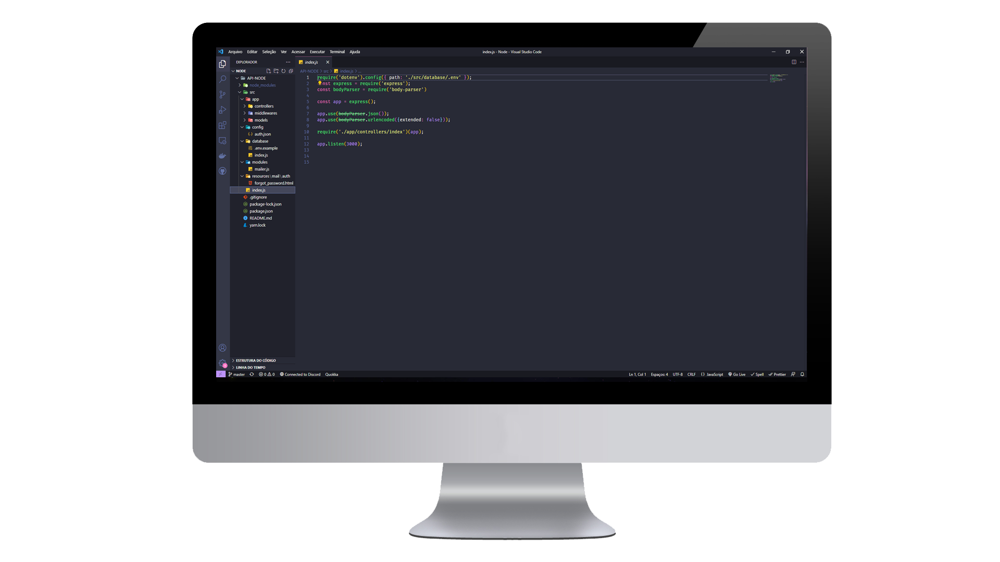

<h1 align="center">API Node - JavaScript</h1>

<p align="center">
  <a href="#features">Features</a>&nbsp;&nbsp;&nbsp;|&nbsp;&nbsp;&nbsp;
  <a href="#getting-started">Getting Started</a>&nbsp;&nbsp;&nbsp;|&nbsp;&nbsp;&nbsp;
  <a href="#reference">Reference</a>
</p>
</img>


This project was developed with the following technologies:
## 🎓 Features
- [Node.js](https://nodejs.org/en/)
- [JavaScript](https://developer.mozilla.org/pt-BR/docs/Web/JavaScript)
- [Express](https://expressjs.com/pt-br/)
- [JSONWebToken](https://github.com/auth0/node-jsonwebtoken#readme)
- [MongoDB](https://www.mongodb.com/pt-br)

## 💻 Reference

This API was developed in order to implement Express together with MongoDb, using javascript

## 🚀 Getting Started
```

- Clone the repository
- Run `yarn` to download dependencies
- enter the mongo db database url as the file shows, .env.example, you can take the .example or create a new variables file.
- Run `yarn dev` to start the app.

````


Made with 💜 by Yago B. Fontoura and RocketSeat 👋🏼 See my<a href="https://www.linkedin.com/in/yago-fontoura/">
        
    </a>


